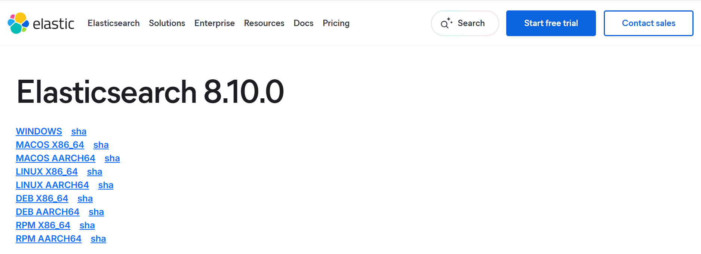

## Linux
步骤1：下载Elasticsearch
进入/usr/local/software/download目录（如果没有手动创建），然后通过curl命令下载
```bash
curl -O https://artifacts.elastic.co/downloads/elasticsearch/elasticsearch-8.10.0-linux-x86_64.tar.gz
```
步骤2：解压文件
将文件解压到/usr/local/software目录下。
```bash
tar -zxvf elasticsearch-8.10.0-linux-x86_64.tar.gz -C ../
```
步骤3：启动ES
## Windows
访问 [Elasticsearch 官方下载页面](https://www.elastic.co/cn/downloads/past-releases?product=elasticsearch)，选择 8.10.0 版本。

## MacOS
